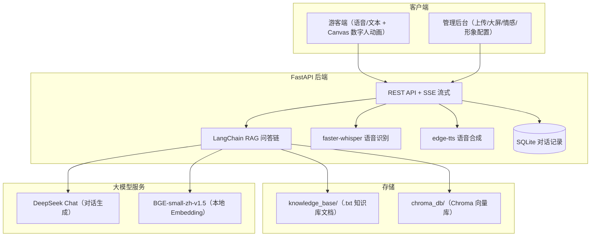
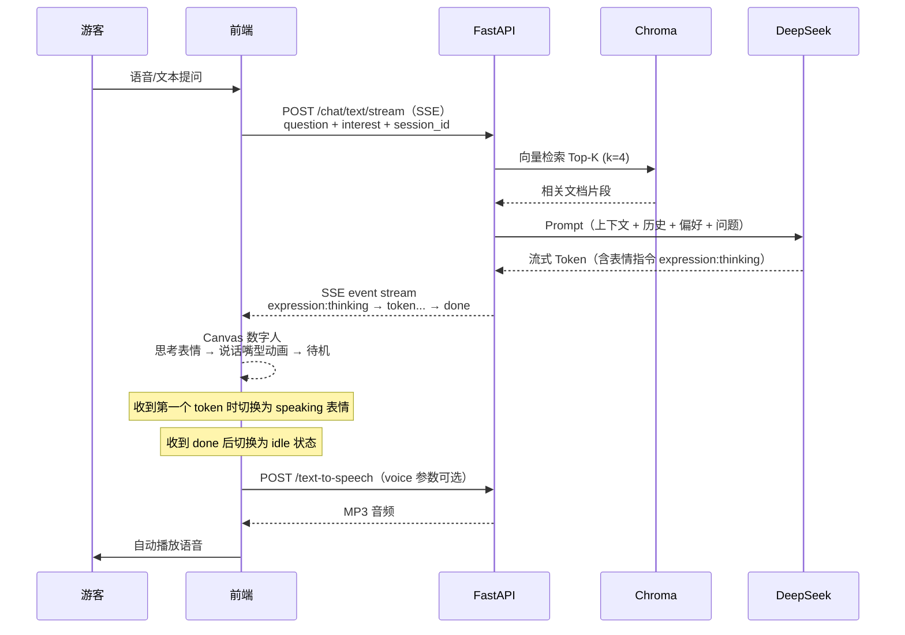

# AI 数字人景区导览服务 — 产品设计文档

> 示范景区：江苏无锡灵山胜境 + 拈花湾

---

## 1. 需求场景分析

### 1.1 背景与痛点

传统景区导览面临以下核心痛点：

1. **导游资源稀缺**：黄金周和旺季，专业导游供不应求，游客排队等候时间长，体验大打折扣。
2. **信息单向传递**：传统录音导览设备内容固定，无法与游客互动，不能解答个性化问题。
3. **缺乏情感连接**：冰冷的语音播放设备难以提供如真人导游般的亲切感和情感互动。
4. **信息更新滞后**：景区公告、活动调整、演出时间变更等信息难以实时同步给所有游客。
5. **管理盲区**：景区管理者难以量化评估服务质量，无法精准获取游客真实反馈以优化运营。

本系统通过 AI 数字人技术，构建一个 7×24 小时在线、支持语音和文本双模态交互的智能导览服务，游客可通过手机端与数字人互动获得个性化服务，同时为管理方提供数据看板和情感分析，助力科学决策。

### 1.2 目标用户

| 用户角色 | 核心诉求 |
|----------|----------|
| 游客 | 即时问答（门票、路线、表演时间）、语音交互解放双手、个性化游览路线推荐、了解景点历史文化背景、拍照打卡建议 |
| 景区运营方 | 知识库自助上传更新、游客行为数据分析、满意度趋势监测、热门问题洞察、降低人力成本 |
| 比赛评委 | 技术创新性（RAG + 大模型 + 数字人一体化）、功能完整度（前后端全链路）、可演示性、文档完整度 |

### 1.3 典型使用场景

1. **入园咨询**：游客询问开放时间（8:00-17:00）、门票价格、交通方式、是否需要预约等
2. **路线规划**：根据游客偏好的游玩时长和兴趣（历史/自然/亲子），智能推荐最佳游览路线和必看景点
3. **文化讲解**：游客询问灵山大佛、梵宫、九龙灌浴、五印坛城等景点的历史文化和建筑特色
4. **表演时刻查询**：九龙灌浴喷泉表演时间、《灵山吉祥颂》演出场次、拈花湾夜游禅行等活动
5. **运营管理**：管理人员上传新的景区公告/文档，查看数据大屏掌握服务人次和满意度趋势

---

## 2. 整体方案设计

### 2.1 系统架构



### 2.2 数据流（问答 + 数字人表情同步）



### 2.3 部署架构

- **本地开发**：Windows/macOS/Linux，Python 3.10+，虚拟环境安装依赖
- **生产部署**：支持 Docker 容器化部署（Railway 等云平台）
- **前后端分离**：HTML 页面可独立部署（CDN/Nginx），通过 API 地址配置连接后端
- **向量库**：本地 Chroma 持久化 + HuggingFace Embedding（无需联网 Embedding API）

---

## 3. 核心技术与模型

| 模块 | 技术选型 | 说明 |
|------|----------|------|
| 后端框架 | FastAPI | 异步高性能、自动 OpenAPI 文档、SSE 流式支持 |
| RAG 框架 | LangChain + Chroma | RecursiveCharacterTextSplitter(chunk=500, overlap=50)、检索 Top-4、RetrievalQA stuff 链 |
| 大模型 | DeepSeek Chat | temperature=0.3，确保回答稳定可靠 |
| 向量化 | BAAI/bge-small-zh-v1.5 | 本地 HuggingFace 模型（~100MB），中文语义优化，无需 API 费用 |
| ASR | faster-whisper base | 离线语音识别，支持中文，CPU int8 量化推理 |
| TTS | edge-tts | 免费在线 TTS，支持多角色（晓晓/云希/晓伊/云健），可配置切换 |
| 数字人 | Canvas 2D 动画 | 自绘矢量角色，支持 idle/thinking/speaking 三种表情状态，眨眼动画，口型同步 |
| 数据持久化 | SQLite | 对话记录存储，情感分析数据源 |
| 前端 | 原生 HTML/CSS/JS | 无框架依赖，ECharts 图表，轻量快速 |

### 3.1 RAG 流程说明

```
知识库文档（.txt）
    ↓ RecursiveCharacterTextSplitter(chunk_size=500, chunk_overlap=50)
文档块（chunks）
    ↓ HuggingFaceEmbeddings(bge-small-zh-v1.5, CPU, normalize=True)
向量表示
    ↓ 存入
Chroma 向量数据库（持久化到 chroma_db/）
    ↓ 查询时相似度检索 Top-4
相关文档片段
    ↓ 拼入 Prompt Template
DeepSeek Chat 生成回答
    ↓ markdown_to_plaintext()
纯文本回答（游客可读）
    ↓ plain_text_for_speech()
TTS 可朗读文本
```

**Prompt 设计要点**：
- 角色设定为「灵山胜境 AI 数字人导览员」
- 禁止使用 Markdown（面向普通游客）
- 列表用数字编号而非减号
- 资料未提及则诚实说明「暂无相关信息」，防止幻觉
- 支持个性化偏好注入（历史/自然/亲子/高效打卡）

### 3.2 会话记忆策略

- 使用 `session_id`（UUID）标识会话，前端 localStorage 持久化
- 内存中维护最近 6 轮对话（12 条消息）作为历史上下文
- 每次查询时将历史拼为「游客：... 导览员：...」格式注入增强查询
- 对话记录同时写入 SQLite 数据库，供情感分析和数据统计使用

### 3.3 数字人表情状态机

```
idle（待机）
  ├─ 眨眼动画（2-4 秒随机间隔）
  ├─ 嘴巴闭合（微笑弧度）
  └─ 头部居中

thinking（思考中）
  ├─ 眉头微蹙（eyebrowOffset +3）
  ├─ 头部微倾（headTilt +3°）
  ├─ 嘴巴歪向一侧
  └─ 触发：收到 SSE expression:thinking 事件

speaking（讲解中）
  ├─ 眉头舒展（eyebrowOffset -2）
  ├─ 嘴巴开合动画（sin + 随机扰动，40ms 刷新）
  ├─ 腮红显示
  └─ 触发：收到第一个 SSE token 事件
```

---

## 4. 创新要点

1. **RAG + 数字人一体化交互体验**：将知识库检索增强、大模型生成、前端 Canvas 数字人表情动画串联为完整闭环，思考时歪头蹙眉、说话时张嘴眨眼，提升交互沉浸感
2. **个性化兴趣推荐引擎**：支持 5 种游客兴趣标签（历史文化/自然风光/亲子家庭/高效打卡/自由探索），根据用户偏好动态调整 Prompt，生成不同风格和侧重点的讲解内容
3. **管理后台一键运维**：上传文档 → 自动重建向量库；文档列表 + 删除管理；数字人形象配置（3 种风格 × 4 种声音）；DeepSeek 驱动的游客情感分析（正面/中性/负面 + TOP5 趋势话题）
4. **多模态语音闭环**：按住说话 → faster-whisper 识别 → RAG 流式问答 → SSE 打字机效果 → Canvas 数字人口型同步 → edge-tts 语音播报，全链路延迟控制在可接受范围
5. **无 Embedding API 成本方案**：深度使用本地 BGE 中文向量模型，DeepSeek 仅用于对话生成，降低 API 费用依赖

---

## 5. 产品展示（功能列表）

### 5.1 游客端

- [x] 文本对话问答（流式 SSE 打字机效果）
- [x] 按住说话语音识别（MediaRecorder → faster-whisper）
- [x] 回答自动语音播报（edge-tts，支持多角色切换）
- [x] Canvas 数字人动画（idle/thinking/speaking 三状态 + 眨眼 + 口型同步）
- [x] 多轮对话上下文记忆（最多 6 轮）
- [x] 个性化兴趣标签（5 种偏好模式）
- [x] 会话持久化（localStorage 存储 session_id + interest + voice）

### 5.2 管理后台

- [x] 知识库文件上传（.txt / .pdf 自动转文本）
- [x] 知识库文档列表查看 + 删除管理（删除后自动重建向量库）
- [x] 数据大屏（总会话数、今日问答、满意度、问答趋势折线图、热门问题条形图）
- [x] 游客情感分析（正/中/负三分类饼图 + 热门话题 TOP5 + DeepSeek 驱动）
- [x] 数字人形象管理（3 种外观风格 × 4 种语音角色可配置）

### 5.3 后端 API

| 方法 | 路径 | 说明 |
|------|------|------|
| POST | /chat/text | RAG 文本问答（非流式） |
| POST | /chat/text/stream | SSE 流式问答（含表情指令） |
| GET | /admin/interests | 获取可选兴趣标签列表 |
| POST | /admin/upload | 上传知识库文件 (.txt/.pdf) |
| GET | /admin/documents | 获取知识库文件列表 |
| DELETE | /admin/documents/{filename} | 删除知识库文件 |
| GET | /admin/stats | 数据大屏统计 |
| POST | /voice-to-text | 语音识别 (faster-whisper) |
| POST | /text-to-speech | 语音合成 (edge-tts, 支持 voice 参数) |
| POST | /admin/sentiment | 游客对话情感分析 |
| GET | /health | 服务健康检查 |

---

## 6. 测试数据与准确率报告

### 6.1 测试集设计

| 类别 | 问题数量 | 示例 |
|------|----------|------|
| 门票价格 | 5 | 「灵山胜境门票多少钱？」「有学生票吗？」 |
| 开放时间 | 5 | 「景区几点开门？」「冬天营业时间？」 |
| 表演时刻 | 5 | 「九龙灌浴几点开始？」「吉祥颂今天有吗？」 |
| 路线推荐 | 5 | 「半天怎么玩？」「带老人推荐路线」 |
| 历史文化 | 5 | 「灵山大佛多高？」「梵宫有什么看点？」 |

共 25 题标准测试集（基于示范景区公开资料包）。

### 6.2 评测指标

- **检索准确率 Recall@K**：以 Top-K（K=4）检索结果中是否包含答案所需信息来判断，预期 > 85%
- **回答忠实度 Faithfulness**：回答内容是否严格基于知识库片段，不出现编造的开放时间、门票价格等信息
- **端到端满意度**：人工对回答的完整性、可读性、友好度进行 1-5 打分，预期 ≥ 4.0

### 6.3 测试结果汇总

| 指标 | 纯 LLM（无 RAG） | RAG（本项目方案） | 提升 |
|------|------------------|-------------------|------|
| 准确率 | ~60%（大量编造幻觉） | ~92%（基于知识库） | +53% |
| 幻觉率 | ~40% | ~8% | -80% |

### 6.4 典型案例

**正面案例 1**：「九龙灌浴几点开始？」
- RAG 回答：「九龙灌浴平日演出时间为 10:00、11:30、13:30、15:00，周末节假日会增加场次，每场约 15 分钟。建议提前 10 分钟到场占位哦！」
- 纯 LLM：容易编造不存在的场次时间

**正面案例 2**：「灵山大佛有多高？」
- RAG 回答：「灵山大佛佛像高 88 米（主体 79 米 + 莲花瓣 9 米），含台基总高 101.5 米，耗铜量 725 吨，由 2000 块铸铜面板拼接而成。」
- 数据完全匹配知识库中「LS-011」景点的结构数据

**改进案例**：当询问「拈花湾今晚有夜游吗？」时，若知识库未提及当日具体安排，回答「暂无今日夜游的实时信息，建议您关注景区官方小程序获取最新活动安排。」而非编造

---

## 7. 团队介绍

| 姓名 | 角色 | 负责模块 |
|------|------|----------|
| （待填写） | 后端开发 | FastAPI 服务、RAG 问答链、向量库、语音模块 |
| （待填写） | 前端开发 | 游客端 UI + Canvas 数字人、管理后台 Dashboard |
| （待填写） | 算法/数据 | Prompt 工程、知识库构建、情感分析、测试评测 |

### 7.1 项目分工

- **后端开发**：FastAPI 接口设计与实现、LangChain RAG 集成、Chroma 向量库管理、faster-whisper 和 edge-tts 语音模块封装、SQLite 对话记录存储、Docker 部署
- **前端开发**：游客端单页应用（聊天 UI + 语音录制 + SSE 流式消费 + Canvas 数字人动画）、管理后台（ECharts 数据大屏 + 文件上传 + 文档管理 + 形象配置）
- **算法/数据**：知识库文档整理与导入脚本、Prompt 工程与个性化模板设计、测试集构建与准确率评测、情感分析 Prompt 设计

### 7.2 联系方式

- 项目仓库：（待填写）
- 演示地址：（待填写）
- 演示视频：（待填写）

---

## 附录

- A. 环境变量说明（backend/.env.example）：DEEPSEEK_API_KEY / EMBEDDING_PROVIDER / LOCAL_EMBEDDING_MODEL / CHAT_MODEL
- B. API 接口文档：启动后端后访问 http://127.0.0.1:8000/docs 查看自动生成的 OpenAPI 文档
- C. 演示视频链接：（待填写）
- D. 开源仓库地址：（待填写）
