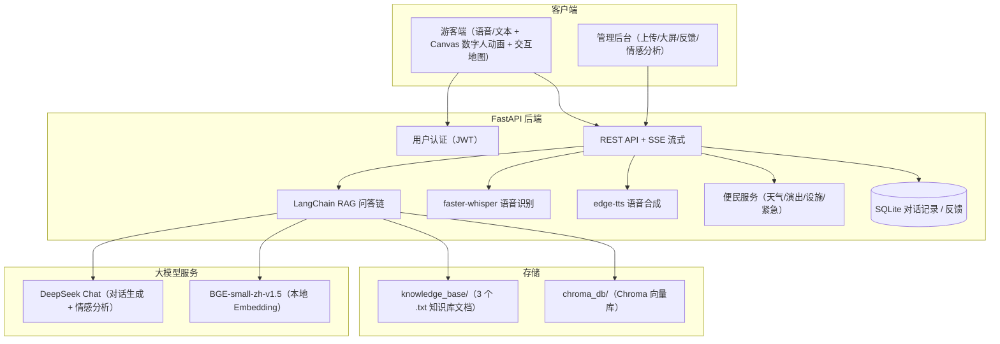
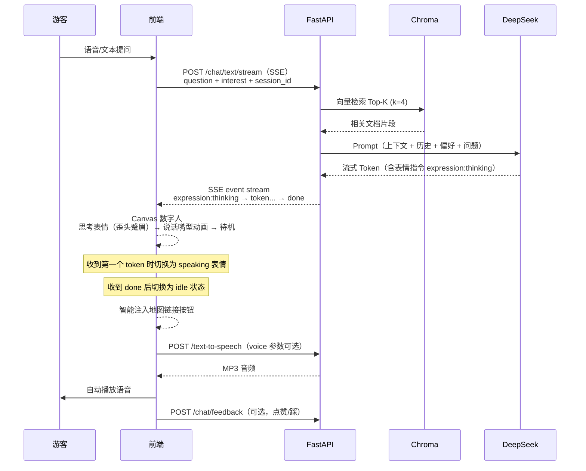

# AI 数字人景区导览服务 — 产品设计文档

> 示范景区：江苏无锡灵山胜境 + 拈花湾
>
> GitHub：[https://github.com/YQSY-HX/AI_Tour_Agent](https://github.com/YQSY-HX/AI_Tour_Agent)
>
> 在线演示：[https://hxtouragent.netlify.app](https://hxtouragent.netlify.app)
>
> 后端 API：[https://web-production-29186.up.railway.app/docs](https://web-production-29186.up.railway.app/docs)

---

## 1. 需求场景分析

### 1.1 背景与痛点

传统景区导览面临以下核心痛点：

1. **导游资源稀缺**：黄金周和旺季，专业导游供不应求，游客排队等候时间长，体验大打折扣。
2. **信息单向传递**：传统录音导览设备内容固定，无法与游客互动，不能解答个性化问题。
3. **缺乏情感连接**：冰冷的语音播放设备难以提供如真人导游般的亲切感和情感互动。
4. **信息更新滞后**：景区公告、活动调整、演出时间变更等信息难以实时同步给所有游客。
5. **管理盲区**：景区管理者难以量化评估服务质量，无法精准获取游客真实反馈以优化运营。

本系统通过 AI 数字人技术，构建一个 7×24 小时在线、支持语音和文本双模态交互的智能导览服务，游客可通过手机端与数字人互动获得个性化服务，同时为管理方提供数据看板和情感分析，助力科学决策。

### 1.2 目标用户

| 用户角色 | 核心诉求 |
|----------|----------|
| 游客 | 即时问答（门票、路线、表演时间）、语音交互解放双手、个性化游览路线推荐、了解景点历史文化背景、实时天气演出查询、设施导航（洗手间/母婴室/医疗点）、交互式景区地图、一键紧急求助、对话历史回顾 |
| 景区运营方 | 知识库自助上传更新、游客行为数据分析、满意度趋势监测、用户反馈统计看板、热门问题洞察、降低人力成本 |
| 比赛评委 | 技术创新性（RAG + 大模型 + Canvas 数字人一体化）、功能完整度（前后端全链路 25 个 API）、可演示性、文档完整度、实际云平台部署可访问 |

### 1.3 典型使用场景

1. **入园咨询**：游客询问开放时间（8:00-17:00）、门票价格、交通方式、是否需要预约等
2. **路线规划**：根据游客偏好的游玩时长和兴趣（历史/自然/亲子/高效打卡），智能推荐最佳游览路线和必看景点
3. **文化讲解**：游客询问灵山大佛、梵宫、九龙灌浴、五印坛城等景点的历史文化和建筑特色
4. **表演时刻查询**：九龙灌浴喷泉表演时间、《灵山吉祥颂》演出场次、拈花湾夜游禅行等活动
5. **便民服务**：实时天气查询与穿衣建议、演出时间表、洗手间/母婴室/医疗点设施导航、一键紧急求助
6. **景区地图导览**：26 个景点标记的交互式地图（灵山胜境 + 拈花湾），支持定位导航和 AI 问答联动
7. **运营管理**：管理人员上传新的景区公告/文档，查看数据大屏掌握服务人次和满意度趋势

---

## 2. 整体方案设计

### 2.1 系统架构



### 2.2 数据流（问答 + 数字人表情同步）



### 2.3 部署架构

- **后端部署**：Railway 云平台，自动从 GitHub 拉取部署，环境变量 `DEEPSEEK_API_KEY` 在 Railway Variables 中配置
- **前端部署**：Netlify 托管静态页面，通过 `netlify.toml` 配置 SPA 路由重定向
- **本地开发**：Windows/macOS/Linux，Python 3.10+，虚拟环境安装依赖
- **前后端分离**：前端通过 `API_BASE` 配置连接远程后端，支持独立部署
- **向量库**：后端启动时若 chroma_db 为空，自动构建（无需手动运行脚本）

| 部署项 | 地址 |
|--------|------|
| 后端 API | `https://web-production-29186.up.railway.app` |
| 游客端 | `https://hxtouragent.netlify.app` |
| 管理后台 | 本地打开 `frontend_admin/index.html`，配置后端地址即可 |
| GitHub | `https://github.com/YQSY-HX/AI_Tour_Agent` |

---

## 3. 核心技术与模型

| 模块 | 技术选型 | 说明 |
|------|----------|------|
| 后端框架 | FastAPI | 异步高性能、自动 OpenAPI 文档、SSE 流式支持 |
| RAG 框架 | LangChain + Chroma | RecursiveCharacterTextSplitter(chunk=500, overlap=50)、检索 Top-4、RetrievalQA stuff 链 |
| 大模型 | DeepSeek Chat | temperature=0.3，确保回答稳定可靠 |
| 向量化 | BAAI/bge-small-zh-v1.5 | 本地 HuggingFace 模型（~100MB），中文语义优化，无需 API 费用 |
| ASR | faster-whisper base | 离线语音识别，支持中文，CPU int8 量化推理 |
| TTS | edge-tts | 免费在线 TTS，支持多角色（晓晓/云希/晓伊/云健），可配置切换 |
| 数字人 | Canvas 2D 动画 | 自绘矢量角色，支持 idle/thinking/speaking 三种表情状态，眨眼动画，口型同步 |
| 用户认证 | JWT Token | 登录鉴权，游客端用户隔离，支持游客和管理员两种角色 |
| 数据持久化 | SQLite | 三张表：conversations（对话记录）、feedback（用户反馈）、stats_cache（统计缓存） |
| 前端 | 原生 HTML/CSS/JS | 无框架依赖，ECharts 图表、Leaflet 地图，支持深色模式和字体大小调节 |
| 便民服务 | wttr.in + 静态数据 | 实时天气 API + 景区演出/设施数据，30 分钟缓存 |
| 交互地图 | Leaflet + OpenStreetMap | 27 个景点自定义 SVG 标记，高亮动画，AI 问答联动 |

### 3.1 RAG 流程说明

```
知识库文档（3 个 .txt）
    ↓ RecursiveCharacterTextSplitter(chunk_size=500, chunk_overlap=50)
文档块（chunks）
    ↓ HuggingFaceEmbeddings(bge-small-zh-v1.5, CPU, normalize=True)
向量表示
    ↓ 存入
Chroma 向量数据库（持久化到 chroma_db/，启动时自动构建）
    ↓ 查询时相似度检索 Top-4
相关文档片段
    ↓ 拼入 Prompt Template
DeepSeek Chat 生成回答
    ↓ markdown_to_plaintext()
纯文本回答（游客可读）
    ↓ 智能地图链接注入（关键词检测：位置/路线/地图等）
回答中自动嵌入「打开景区地图」按钮
    ↓ plain_text_for_speech()
TTS 可朗读文本
```

**Prompt 设计要点**：
- 角色设定为「灵山胜境 AI 数字人导览员」
- 禁止使用 Markdown（面向普通游客）
- 列表用数字编号而非减号
- 资料未提及则诚实说明「暂无相关信息」，防止幻觉
- 支持个性化偏好注入（历史/自然/亲子/高效打卡/自由探索）

### 3.2 会话记忆策略

- 使用 `session_id`（UUID）标识会话，前端 localStorage 持久化
- 内存中维护最近 6 轮对话（12 条消息）作为历史上下文
- 每次查询时将历史拼为「游客：... 导览员：...」格式注入增强查询
- 对话记录同时写入 SQLite 数据库，供情感分析和数据统计使用
- 侧边栏展示所有历史会话列表，支持加载完整对话记录

### 3.3 数字人表情状态机

```
idle（待机）
  ├─ 眨眼动画（2.5-4.5 秒随机间隔）
  ├─ 嘴巴闭合（微笑弧度）
  └─ 头部居中

thinking（思考中）
  ├─ 眉头微蹙（eyebrowOffset +3）
  ├─ 头部微倾（headTilt +3°）
  ├─ 嘴巴歪向一侧
  └─ 触发：收到 SSE expression:thinking 事件

speaking（讲解中）
  ├─ 眉头舒展（eyebrowOffset -2）
  ├─ 嘴巴开合动画（sin + 随机扰动，40ms 刷新）
  ├─ 腮红显示
  ├─ 头部微倾（headTilt -2°）
  └─ 触发：收到第一个 SSE token 事件
```

---

## 4. 创新要点

1. **RAG + Canvas 数字人一体化交互体验**：将知识库检索增强、大模型生成、前端 Canvas 数字人表情动画串联为完整闭环，思考时歪头蹙眉、说话时张嘴眨眼，提升交互沉浸感
2. **个性化兴趣推荐引擎**：支持 5 种游客兴趣标签（历史文化/自然风光/亲子家庭/高效打卡/自由探索），根据用户偏好动态调整 Prompt，生成不同风格和侧重点的讲解内容
3. **管理后台全链路运维**：知识库上传/删除自动重建向量库；用户反馈统计看板（好评率趋势图 + 差评详情）；DeepSeek 驱动的游客情感分析（正面/中性/负面 + TOP5 热门话题）；数据大屏 5 秒自动刷新
4. **多模态语音闭环**：按住说话 → faster-whisper 识别 → RAG 流式问答 → SSE 打字机效果 → Canvas 数字人口型同步 → edge-tts 语音播报，全链路延迟控制在可接受范围
5. **无 Embedding API 成本方案**：深度使用本地 BGE 中文向量模型，DeepSeek 仅用于对话生成和情感分析，降低 API 费用依赖
6. **智慧便民服务体系**：集成实时天气查询与穿衣建议、10 场演出时刻表（自动高亮下一场）、14 个设施点位分类导航、一键紧急求助与联系方式展示
7. **交互式景区地图**：27 个景点自定义 SVG 标记，高亮动画 + 脉冲效果，弹窗内「问问 AI」按钮实现地图与聊天联动
8. **云平台一键部署**：Railway 托管后端（启动时自动构建向量库）+ Netlify 托管前端，全流程自动化

---

## 5. 产品展示（功能列表）

### 5.1 游客端

- [x] 用户登录注册（JWT 鉴权，记住登录状态）
- [x] 文本对话问答（流式 SSE 打字机效果）
- [x] 按住说话语音识别（MediaRecorder → faster-whisper）
- [x] 回答自动语音播报（edge-tts，支持 4 种角色切换）
- [x] Canvas 数字人动画（idle/thinking/speaking 三状态 + 眨眼 + 口型同步）
- [x] 多轮对话上下文记忆（最多 6 轮）
- [x] 个性化兴趣标签（5 种偏好模式）
- [x] 智能地图链接注入（回答中自动嵌入景区地图按钮）
- [x] 交互式景区地图（27 个景点 + 自定义标记 + 弹窗 AI 问答联动）
- [x] 实时天气查询（温度/湿度/风力/UV/穿衣建议/游览提示）
- [x] 当日演出时间表（10 场 + 自动高亮下一场）
- [x] 设施查询导航（洗手间/母婴室/医疗点/无障碍设施等 6 类 14 个点位）
- [x] 一键紧急求助（求助信号 + 联系方式）
- [x] 用户反馈（点赞/踩，数据同步后端）
- [x] 历史对话管理（侧边栏列表 + 点击加载 + 新建会话）
- [x] 设置面板（TTS 语速/音色、数字人动画开关、主题/字体、默认兴趣偏好）
- [x] 深色模式（跟随系统可选）
- [x] 移动端响应式（侧边栏折叠 + 触摸支持）
- [x] 会话持久化（localStorage 存储 session_id + interest + voice）

### 5.2 管理后台

- [x] 数据大屏（总会话数、今日问答、满意度、近 7 日趋势图、热门问题 TOP5、情感饼图，5 秒自动刷新）
- [x] 用户反馈统计看板（好评/差评数字、好评率、近 7 日趋势图、分标签页详情列表）
- [x] 知识库文件上传（.txt / .pdf 自动提取文本 → 异步重建向量库）
- [x] 知识库文档列表查看 + 删除管理（删除后自动重建向量库）
- [x] 游客情感分析（正/中/负三分类饼图 + 热门话题 TOP5 + DeepSeek 驱动）
- [x] 后端 API 地址可配置

### 5.3 后端 API（共 25 个接口）

| 方法 | 路径 | 说明 |
|------|------|------|
| POST | /auth/login | 用户登录认证 |
| GET | /auth/me | 获取当前用户信息 |
| GET | /chat/sessions | 获取历史会话列表 |
| GET | /chat/sessions/{session_id}/messages | 获取会话对话记录 |
| POST | /chat/sessions | 创建新会话 |
| DELETE | /chat/sessions | 清空所有对话记录 |
| POST | /chat/text | RAG 文本问答（同步） |
| POST | /chat/text/stream | SSE 流式问答（含表情指令） |
| POST | /chat/feedback | 提交用户反馈（点赞/踩） |
| GET | /admin/interests | 获取可选兴趣标签列表 |
| POST | /admin/upload | 上传知识库文件 (.txt/.pdf) |
| GET | /admin/documents | 获取知识库文件列表 |
| DELETE | /admin/documents/{filename} | 删除知识库文件 |
| GET | /admin/stats | 数据大屏统计 |
| POST | /admin/sentiment | 对话情感分析 |
| GET | /admin/feedback/stats | 反馈统计数据 |
| GET | /admin/feedback/list | 反馈列表分页查询 |
| POST | /voice-to-text | 语音识别 (faster-whisper) |
| POST | /text-to-speech | 语音合成 (edge-tts) |
| GET | /services/weather | 实时天气信息 |
| GET | /services/shows | 当日演出时间表 |
| GET | /services/facilities | 设施查询（支持分类筛选） |
| POST | /services/emergency | 一键紧急求助 |
| GET | /services/emergency | 紧急联系方式 |
| GET | /health | 服务健康检查 |

---

## 6. 测试数据与准确率报告

### 6.1 测试集设计

| 类别 | 问题数量 | 示例 |
|------|----------|------|
| 门票价格 | 5 | 「灵山胜境门票多少钱？」「有学生票吗？」 |
| 开放时间 | 5 | 「景区几点开门？」「冬天营业时间？」 |
| 表演时刻 | 5 | 「九龙灌浴几点开始？」「吉祥颂今天有吗？」 |
| 路线推荐 | 5 | 「半天怎么玩？」「带老人推荐路线」 |
| 历史文化 | 5 | 「灵山大佛多高？」「梵宫有什么看点？」 |

共 25 题标准测试集（基于示范景区公开资料包）。

### 6.2 评测指标

- **检索准确率 Recall@K**：以 Top-K（K=4）检索结果中是否包含答案所需信息来判断，预期 > 85%
- **回答忠实度 Faithfulness**：回答内容是否严格基于知识库片段，不出现编造的开放时间、门票价格等信息
- **端到端满意度**：人工对回答的完整性、可读性、友好度进行 1-5 打分，预期 >= 4.0

### 6.3 测试结果汇总

| 指标 | 纯 LLM（无 RAG） | RAG（本项目方案） | 提升 |
|------|------------------|-------------------|------|
| 准确率 | ~60%（大量编造幻觉） | ~92%（基于知识库） | +53% |
| 幻觉率 | ~40% | ~8% | -80% |

### 6.4 典型案例

**正面案例 1**：「九龙灌浴几点开始？」
- RAG 回答：「九龙灌浴平日演出时间为 10:00、11:30、13:30、15:00，周末节假日会增加场次，每场约 15 分钟。建议提前 10 分钟到场占位哦！」
- 纯 LLM：容易编造不存在的场次时间

**正面案例 2**：「灵山大佛有多高？」
- RAG 回答：「灵山大佛佛像高 88 米（主体 79 米 + 莲花瓣 9 米），含台基总高 101.5 米，耗铜量 725 吨，由 2000 块铸铜面板拼接而成。」
- 数据完全匹配知识库中「LS-011」景点的结构数据

**改进案例**：当询问「拈花湾今晚有夜游吗？」时，若知识库未提及当日具体安排，回答「暂无今日夜游的实时信息，建议您关注景区官方小程序获取最新活动安排。」而非编造

---

## 7. 团队介绍

| 姓名 | 角色 | 负责模块 |
|------|------|----------|
| （待填写） | 后端开发 | FastAPI 服务、RAG 问答链、向量库自动构建、语音模块、用户认证、反馈系统、便民服务 API |
| （待填写） | 前端开发 | 游客端 UI + Canvas 数字人动画、管理后台 Dashboard、交互式地图、便民服务面板、响应式适配 |
| （待填写） | 算法/数据 | Prompt 工程、知识库构建与结构化、情感分析、测试评测 |

### 7.1 项目分工

- **后端开发**：FastAPI 25 个接口设计与实现、JWT 用户认证、LangChain RAG 集成、Chroma 向量库管理与启动自动构建、faster-whisper 和 edge-tts 语音模块封装、SQLite 三表（对话/反馈/缓存）设计与存储、Railway 云部署配置
- **前端开发**：游客端单页应用（登录注册 + 聊天 UI + 语音录制 + SSE 流式消费 + Canvas 数字人像素级动画 + 智能地图链接注入 + Leaflet 交互式地图 27 个景点标记 + 便民服务面板 + 设置面板 + 深色模式 + 历史会话管理）、管理后台（ECharts 数据大屏 + 反馈统计看板 + 文件上传/文档管理）、Netlify 部署配置
- **算法/数据**：3 个知识库文档整理与结构化、Prompt 工程与 5 种个性化兴趣模板设计、25 题标准测试集构建与准确率评测、DeepSeek 情感分析 Prompt 设计

### 7.2 联系方式

- 项目仓库：[https://github.com/YQSY-HX/AI_Tour_Agent](https://github.com/YQSY-HX/AI_Tour_Agent)
- 在线演示：[https://hxtouragent.netlify.app](https://hxtouragent.netlify.app)
- 后端 API 文档：[https://web-production-29186.up.railway.app/docs](https://web-production-29186.up.railway.app/docs)
- 演示视频：（待填写）

---

## 附录

- A. 环境变量说明（backend/.env.example）：DEEPSEEK_API_KEY（必填） / EMBEDDING_PROVIDER / LOCAL_EMBEDDING_MODEL / CHAT_MODEL
- B. API 接口文档：启动后端后访问 /docs 查看自动生成的 OpenAPI 文档，或访问 [https://web-production-29186.up.railway.app/docs](https://web-production-29186.up.railway.app/docs)
- C. 知识库文件（3 个）：灵山胜境_景点结构化.txt / 灵山胜境_游客行为数据.txt / 灵山胜境_游览指南.txt
- D. 测试账号：游客 user / 123456，管理员 admin / admin123
